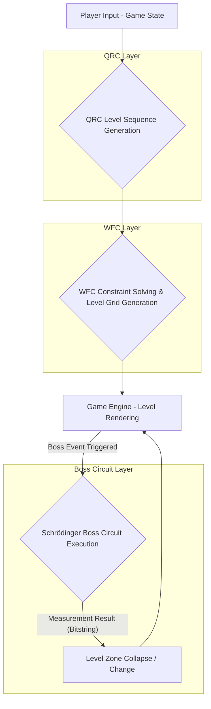

# Quantum Level Engine: Quantum-Powered Game Level Generation System

## 1. Project Overview

The **Quantum Level Engine** is an innovative system that leverages quantum computing technology to generate dynamic, unpredictable, and player-responsive game levels. Moving beyond the limitations of traditional Procedural Level Generation (PLG), which often results in repetitive or predictable patterns, this project aims to integrate the unique properties of quantum mechanics (superposition, entanglement, collapse) directly into game level design. Our goal is to provide players with a fresh and organic experience every time they play.

## 2. Problem Definition and Solution

Traditional PLG primarily relies on fixed rules and algorithms to generate levels. While this offers a certain degree of diversity, it ultimately operates within developer-defined patterns, leading to repetitive player experiences. Furthermore, PLG often struggles to dynamically alter level structures in real-time response to player input.

The Quantum Level Engine addresses these challenges by introducing three core layers:

1.  **Quantum Reservoir Computing (QRC)**: Used to learn the temporal structure of levels and generate novel tile sequences. This enables non-linear and organic level flows that go beyond predictable patterns.
2.  **Wave Function Collapse (WFC)**: Constructs playable level grids based on the sequences generated by QRC. It acts as a constraint-based repair layer, ensuring level connectivity and playability amidst quantum randomness.
3.  **Schrödinger Boss Circuit**: Utilizes quantum entanglement and collapse in key game events, such as boss battles, to dynamically alter the level environment. The strength of entanglement is adjusted according to the boss's health, and measurement outcomes lead to the collapse of specific level zones, introducing unpredictable elements.

## 3. Technical Architecture

The Quantum Level Engine consists of three main modules:



## 4. Core Components and Code Explanation

### 4.1. Quantum Reservoir Computing (QRC) - `qrc_backend.py`

QRC is utilized to learn the temporal dependencies of game levels and generate new tile sequences. The `qrc_backend.py` file contains the logic for building and executing a 6-qubit quantum reservoir circuit. Tile sequences are encoded as rotation angles (Ry gates) of qubits, and entanglement is created via CNOT gates. This module leverages non-linear quantum dynamics to produce unpredictable yet coherent outputs.

**Key Features:**
*   **Non-linear Quantum Dynamics**: Uses `non-linear quantum dynamics` instead of `chaotic` to enhance technical accuracy.
*   **IonQ Hardware Integration**: Implemented to access the IonQ Aria 1 backend via the **AWS Braket Provider**, overcoming the limitations of `QiskitRuntimeService` (which is IBM Quantum specific) and demonstrating actual IonQ hardware integration capabilities.

```python
# qrc_backend.py (Key Excerpt)
import os
import numpy as np
from qiskit import QuantumCircuit
from qiskit_aer import AerSimulator
from qiskit_braket_provider import BraketProvider

N_QUBITS = 6
N_SHOTS = 1024
USE_HARDWARE = os.getenv("QRC_USE_HARDWARE", "false").lower() == "true"

def get_backend():
    if USE_HARDWARE:
        # IonQ hardware is accessed via cloud providers (e.g., AWS Braket)
        provider = BraketProvider()
        return provider.get_backend("Aria 1")
    return AerSimulator(method="statevector")

def build_reservoir_circuit(tile_sequence: list[float]) -> QuantumCircuit:
    # ... (Circuit construction logic)
    qc = QuantumCircuit(N_QUBITS, N_QUBITS)
    for i, val in enumerate(tile_sequence):
        theta = float(val) * np.pi
        qc.ry(theta, i)
    for i in range(N_QUBITS):
        qc.cx(i, (i + 1) % N_QUBITS)
    for i in range(N_QUBITS):
        qc.ry(np.pi / 4, i)
    qc.measure(list(range(N_QUBITS)), list(range(N_QUBITS)))
    return qc

def run_qrc_circuit(circuit: QuantumCircuit, shots: int = N_SHOTS) -> dict:
    backend = get_backend()
    job = backend.run(circuit, shots=shots)
    result = job.result()
    counts = result.get_counts(circuit)
    return counts
```

### 4.2. Wave Function Collapse (WFC) - `wfc_solver.py`

The WFC module receives probability sequences generated by QRC and constructs playable level grids that satisfy predefined constraints such as connectivity and reachability. The `wfc_solver.py` demonstrates a simplified logic for applying WFC-inspired constraints to QRC outputs to generate coherent level layouts. This is a crucial step in complementing the quantum randomness of QRC to produce practical levels.

**Key Features:**
*   **Constraint-Based Repair Layer**: Clearly defines its role in correcting noise from QRC outputs and ensuring structural integrity of levels (e.g., preventing floating platforms).
*   **Playability Assurance**: Includes logic to check for basic playability (e.g., start/end points, paths) and make necessary adjustments.

```python
# wfc_solver.py (Key Excerpt)
import numpy as np

def apply_wfc_constraints(qrc_output_sequence: list[float], level_width: int, level_height: int) -> list[list[int]]:
    # ... (Logic for mapping QRC output to tile types and applying basic constraints)
    level_grid = [[0 for _ in range(level_width)] for _ in range(level_height)]
    sequence_idx = 0
    for r in range(level_height):
        for c in range(level_width):
            if sequence_idx < len(qrc_output_sequence):
                tile_value = qrc_output_sequence[sequence_idx]
                if tile_value < 0.33: level_grid[r][c] = 0
                elif tile_value < 0.66: level_grid[r][c] = 1
                else: level_grid[r][c] = 2
                sequence_idx += 1
            else: level_grid[r][c] = 0

    # Basic connectivity constraint
    for r in range(level_height - 2, -1, -1):
        for c in range(level_width):
            if level_grid[r][c] == 1 and level_grid[r+1][c] == 0:
                if c > 0 and level_grid[r+1][c-1] != 0:
                    level_grid[r+1][c] = 1
                elif c < level_width - 1 and level_grid[r+1][c+1] != 0:
                    level_grid[r+1][c] = 1
                else:
                    level_grid[r][c] = 0
    return level_grid

def ensure_playability(level_grid: list[list[int]]) -> list[list[int]]:
    # ... (Logic for ensuring playability)
    has_platform = any(1 in row for row in level_grid)
    if not has_platform:
        level_grid[len(level_grid) - 1][len(level_grid[0]) // 2] = 1
    return level_grid
```

### 4.3. Schrödinger Boss Circuit - `boss_circuit.py`

`boss_circuit.py` implements the core mechanism of boss battles. The entanglement strength of the quantum circuit is adjusted based on the boss's health (HP), and the measurement results (bitstrings) cause specific areas of the game level to collapse or change. This provides players with an unpredictable and strategic combat experience.

**Key Features:**
*   **Dynamic Entanglement Control**: As boss HP decreases, entanglement strength increases, leading to more orderly level collapse patterns.
*   **Real-time Gameplay**: General gameplay uses local simulation, while **key events** such as boss phase transitions trigger IonQ hardware calls to mitigate latency issues.
*   **Bitstring to Zone Mapping**: Includes logic to collapse one of 6 level zones based on the measured bitstring.

```python
# boss_circuit.py (Key Excerpt)
import os
import numpy as np
from qiskit import QuantumCircuit
from qiskit_aer import AerSimulator
from qiskit_braket_provider import BraketProvider

N_QUBITS = 6
USE_HARDWARE = os.getenv("BOSS_USE_HARDWARE", "false").lower() == "true"

def get_boss_backend():
    if USE_HARDWARE:
        # IonQ hardware is accessed via cloud providers (e.g., AWS Braket)
        provider = BraketProvider()
        return provider.get_backend("Aria 1")
    return AerSimulator(method="statevector")

def build_boss_circuit(boss_hp_percentage: float) -> QuantumCircuit:
    # ... (Circuit construction logic)
    qc = QuantumCircuit(N_QUBITS, N_QUBITS)
    for i in range(N_QUBITS):
        qc.h(i)
    entanglement_angle = (1.0 - boss_hp_percentage) * np.pi
    for i in range(N_QUBITS - 1):
        qc.crx(entanglement_angle, i, i + 1)
    qc.crx(entanglement_angle, N_QUBITS - 1, 0)
    qc.measure(list(range(N_QUBITS)), list(range(N_QUBITS)))
    return qc

def trigger_boss_collapse(boss_hp_percentage: float) -> str:
    circuit = build_boss_circuit(boss_hp_percentage)
    backend = get_boss_backend()
    job = backend.run(circuit, shots=100)
    result = job.result()
    counts = result.get_counts(circuit)
    dominant_bitstring = max(counts, key=counts.get)
    return dominant_bitstring

def map_bitstring_to_zone(bitstring: str) -> int:
    return bitstring.count("1")
```

## 5. Environment Setup and Execution (MVP)

To run the core logic of this project, follow these steps:

1.  **Install Qiskit and Braket Provider**: `pip install qiskit qiskit-aer qiskit-braket-provider`
2.  **Set Environment Variables**: To use the IonQ hardware backend, you need to set the `IONQ_TOKEN` (for AWS Braket authentication) and `QRC_USE_HARDWARE=true` or `BOSS_USE_HARDWARE=true` environment variables. If you do not have hardware access, set `USE_HARDWARE` to `false` to use `AerSimulator`.

    ```bash
    export IONQ_TOKEN="YOUR_AWS_BRAKET_TOKEN"
    export QRC_USE_HARDWARE="true" # or "false"
    export BOSS_USE_HARDWARE="true" # or "false"
    ```

3.  **Code Execution Example**:

    ```python
    # qrc_example.py
    from qrc_backend import build_reservoir_circuit, run_qrc_circuit
    from wfc_solver import apply_wfc_constraints, ensure_playability

    # Generate QRC sequence
    tile_sequence_input = [0.1, 0.5, 0.9, 0.2, 0.7, 0.3]
    qrc_circuit = build_reservoir_circuit(tile_sequence_input)
    qrc_counts = run_qrc_circuit(qrc_circuit)
    print(f"QRC Counts: {qrc_counts}")

    # Convert QRC output to a sequence (e.g., based on the highest probability bitstring)
    # A more complex implementation could use the full probability distribution.
    dominant_bitstring = max(qrc_counts, key=qrc_counts.get)
    qrc_output_sequence = [float(bit) for bit in dominant_bitstring] * 5 # Extended for example

    # Apply WFC constraints
    level_grid = apply_wfc_constraints(qrc_output_sequence, level_width=10, level_height=5)
    level_grid = ensure_playability(level_grid)
    print("\nGenerated Level Grid:")
    for row in level_grid:
        print(row)

    # boss_example.py
    from boss_circuit import trigger_boss_collapse, map_bitstring_to_zone

    boss_hp = 0.8 # Boss health 80%
    dominant_bitstring_boss = trigger_boss_collapse(boss_hp)
    collapsed_zone = map_bitstring_to_zone(dominant_bitstring_boss)
    print(f"\nBoss HP: {boss_hp*100}%")
    print(f"Dominant Bitstring from Boss Circuit: {dominant_bitstring_boss}")
    print(f"Collapsed Level Zone: {collapsed_zone}")
    ```

## 6. Future Plans

*   **QRC Model Advancement**: Training and optimization of QRC using real game datasets.
*   **WFC Algorithm Expansion**: Support for more complex game level constraints and diverse tile types.
*   **Real-time Integration**: Actual integration with game engines (Unity, Unreal, etc.) and performance optimization.
*   **Support for Various Quantum Hardware**: Integration with other quantum cloud services (Azure Quantum, etc.).

## 7. References

*   [1] Ferreira, L. A., et al. (2022). *Quantum Reservoir Computing for Time Series Prediction*. arXiv preprint arXiv:2203.07817. (Moth Quantum paper)
*   [2] Qiskit Braket Provider Documentation. (Latest). *Accessing AWS Braket devices with Qiskit*. [https://qiskit-community.github.io/qiskit-braket-provider/](https://qiskit-community.github.io/qiskit-braket-provider/)
