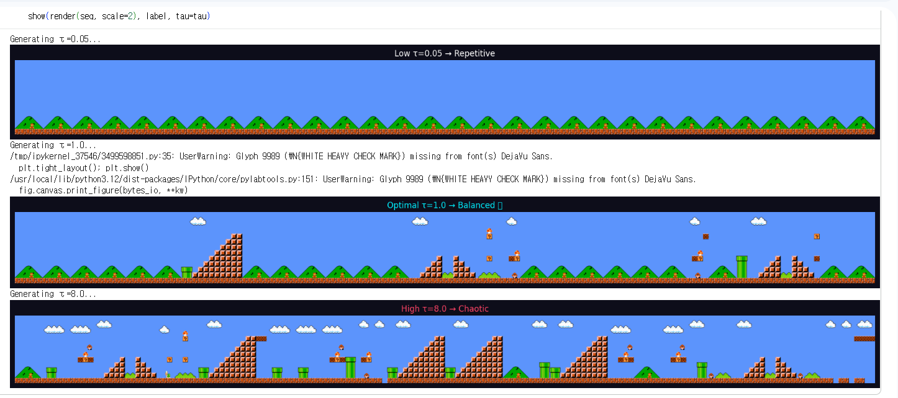

#  Quantum Cyberpunk Supermario

This project is not fully-implemented yet. This project is for Qollab Quantum Challenge Proposal, just implemented some part(game map generation). This is minimal implementation of normal supermario map generation by QRC.
But we propose a cyberpunk Mario-style platformer where a quantum reservoir generates worlds in superposition.
We WANT TO implement real game play, with cyberpunk map tiles, game charactors, and quantum boss with this QRC-based map generation.

## Map generated by QRC 

Some constraints are not strictly defined yet, so that may leads to awkward maps

## Our project in few words

The Quantum Level Engine is a playable cyberpunk platformer powered by **Feedback-Controlled Quantum Reservoir Computing (QRC)**. Levels are not pre-built or randomly generated — they emerge from quantum measurement, making every playthrough fundamentally unique.

The core idea comes from [Ferreira et al., "Level Generation with Quantum Reservoir Computing" (arXiv:2505.13287)](https://arxiv.org/abs/2505.13287): a 6-qubit quantum circuit acts as a fixed dynamical reservoir that learns the temporal structure of level sequences and generates novel variants. A **quantum boss** destabilizes the world in real time by spiking the temperature parameter, forcing the level to collapse into a chaotic state.

